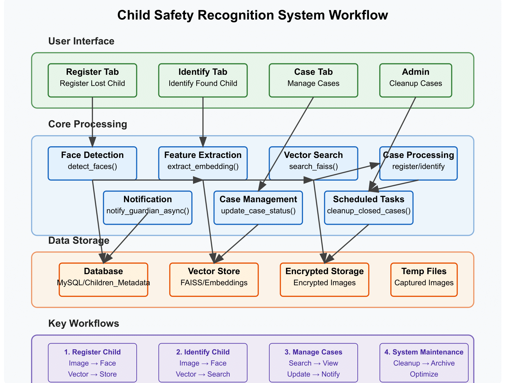

# Child Safe Recognition System

A facial recognition system designed for child safety applications, using YOLOv8 for face detection and FaceNet for creating facial embeddings. This system helps track, identify, and match missing children with securely stored biometric data.

## System Overview

This application provides tools to register missing children, identify them from images/videos/webcam feeds, and manage case statuses. It uses:

- YOLOv8 for robust face detection
- FaceNet for generating facial embeddings
- FAISS vector store for fast similarity searching
- AES encryption for secure image storage
- MySQL database for storing child metadata

## Directory Structure

```
CHILD_SAFE_RECOGNITION_YOLOV8/
├── __pycache__/
├── data/
│   ├── embeddings/     # Stores FAISS index
│   └── images/         # Stores encrypted images
├── temp_captures/      # Temporary image captures
├── temp_decrypts/      # Temporary decrypted images
├── test_images/        # Test images
├── test_videos/        # Test videos
├── webcam_outputs/     # Webcam processing outputs
├── weights/            # Model weights
├── .env                # Environment variables
├── config.py           # Configuration settings
├── database.py         # Database operations
├── embeddings.py       # Face embedding generation
├── encryption.py       # Image encryption/decryption
├── face_detection.py   # YOLOv8 face detection
├── gui.py              # GUI interface
├── main.py             # Main application entry point
├── requirements.txt    # Python dependencies
├── run.sh              # Shell script launcher
├── storage.py          # Image storage management
├── testing_live_webcam.py  # Webcam testing
└── vector_store.py     # FAISS vector operations
```

## File Descriptions

### Core Files

1. **config.py**:

   - Configuration settings including database credentials, paths, thresholds
   - Loads environment variables from .env
   - Sets up directory structure

2. **main.py**:

   - Main application entry point
   - Processes command line arguments for different operations (register, identify, webcam, close)
   - Orchestrates the complete workflow

3. **face\_detection.py**:

   - Implements YOLOv8-based face detection
   - Detects faces in images, videos, and webcam feeds
   - Returns detected face crops for embedding generation

4. **embeddings.py**:

   - Uses FaceNet (InceptionResnetV1) to generate facial embeddings
   - Normalizes and processes face images for consistent embedding generation
   - Returns 512-dimensional embeddings for face matching

5. **vector\_store.py**:

   - Manages FAISS vector index for similarity search
   - Adds, searches, and manages face embeddings
   - Implements similarity scoring and threshold-based matching

6. **database.py**:

   - MySQL database operations
   - Creates and manages the Children\_Metadata table
   - Handles case status updates and data retrieval

7. **encryption.py**:

   - Implements AES encryption for secure image storage
   - Manages encryption keys and secure file operations
   - Provides encrypt/decrypt functionality for child images

8. **storage.py**:

   - Manages secure image storage and retrieval
   - Coordinates with encryption module for image security
   - Handles file operations for stored images

### Support Files

1. **gui.py**: GUI interface for easier interaction with the system
2. **testing\_live\_webcam.py**: Testing utility for webcam functionality
3. **requirements.txt**: Lists all Python dependencies
4. **run.sh**: Shell script for easy execution

## Workflow

### Child Registration Process:

1. Collect child's photo and information
2. Detect faces in the photo using YOLOv8
3. Generate facial embedding using FaceNet
4. Store embedding in FAISS vector store with unique ID
5. Encrypt the child's image and store securely
6. Save metadata (name, age, etc.) in MySQL database
7. Case status is set to "Open"

### Child Identification Process:

1. Capture image/video or use webcam feed
2. Detect faces using YOLOv8
3. Generate facial embeddings for detected faces
4. Search FAISS vector store for similar embeddings
5. Return potential matches above similarity threshold
6. Display matching child information if found
7. Option to close the case if child is correctly identified

### Case Management:

1. List all open cases from database
2. When a child is found, update case status
3. Clean up vector store and encrypted images as needed

## Setup Instructions

### Prerequisites:

- Python 3.8+
- MySQL Server
- CUDA-compatible GPU recommended for better performance

### Installation:

1. **Clone the repository**:

```bash
git clone https://github.com/karannaik503/Child-Safe_Facial_Recognition_for_Lost-and-found_Systems.git
cd CHILD_SAFE_RECOGNITION_YOLOV8
```

2. **Create and activate virtual environment**:

```bash
python -m venv yolofaceenv
source yolofaceenv/bin/activate  # On Windows: yolofaceenv\Scripts\activate
```

3. **Install dependencies**:

```bash
pip install -r requirements.txt
```

4. **Set up MySQL database**:

```bash
mysql -u root -p
CREATE DATABASE child_safety;
USE child_safety;
```
5. **Create Children_Metadata table manually, just in-case there's an error in creation of the table while runing the scripts(optional)**:

```bash
CREATE TABLE IF NOT EXISTS Children_Metadata (
    child_id INT AUTO_INCREMENT PRIMARY KEY,
    name VARCHAR(255) NOT NULL,
    age INT CHECK (age > 0 AND age < 18),
    gender ENUM('Male', 'Female', 'Other') NOT NULL,
    guardian_contact VARCHAR(20) NOT NULL,
    embedding_id VARCHAR(255) UNIQUE,
    image_url VARCHAR(255) UNIQUE,
    case_status ENUM('Open', 'Resolved', 'Closed') DEFAULT 'Open',
    distinguishing_features TEXT,
    last_known_location VARCHAR(255),
    registration_timestamp TIMESTAMP DEFAULT CURRENT_TIMESTAMP,
    last_updated TIMESTAMP DEFAULT CURRENT_TIMESTAMP ON UPDATE CURRENT_TIMESTAMP,
                
    INDEX idx_embedding_id (embedding_id),
    INDEX idx_case_status (case_status)
);
```

6. **Create .env file or make changes in the existing .env file (if present)**:

```
DB_PASSWORD=your_database_password
```

## Usage

### Register a missing child:

```bash
python main.py register [image_path] [name] [age] [gender] [guardian_contact]
```

### Identify a child from an image:

```bash
python main.py identify [image_path]
```

### Identify a child using webcam:

```bash
python main.py webcam
```

### Close a child's case:

```bash
python main.py close [embedding_id]
```

### Run the python GUI:

```bash
python gui.py
```

## GUI Workflow

### 1. Application Initialization
The main application (**ChildSafetyApp**) initializes the database and sets up a multi-tab GUI with three primary functionalities:

- **Register Lost Child**
- **Identify Found Child**
- **Manage Cases**

### 2. Register Lost Child Tab
This section allows users to register details of a lost child, including uploading or capturing an image.

#### Image Handling:
- Upload an image from local storage.
- Capture an image using a webcam.

#### Child Details Form:
- Name
- Age
- Gender (via dropdown menu)
- Guardian Contact
- Distinguishing Features
- Last Known Location

#### Actions:
- Submit the form to register the child in the system.
- Store encrypted images and metadata in the database.

### 3. Identify Found Child Tab
This tab is used to identify a found child by matching their image or video against the database.

#### Input Options:
- Upload an image or video for identification.
- Capture an image using a webcam.

#### Identification Process:
- The system uses facial recognition to match uploaded data with existing records.
- Results are displayed in a text area, including potential matches and embedding IDs.

#### Additional Features:
- Notify guardians of identified children.
- Close identified cases directly from this tab.

#### Preview & Results Display:
- A results section displays matched images and details with scrollable functionality for easy navigation.

### 4. Manage Cases Tab
This tab provides tools for managing open cases of lost children.

#### Search Functionality:
- Search cases by embedding ID or child name.

#### Case Details:
- Displays metadata (e.g., name, age, guardian contact) and associated images in a split view.

#### Actions:
- Close cases manually after resolution.
- Notify guardians about updates.

#### Case List:
- A tree view displays all open cases with sortable columns (e.g., Name, Age, Gender).

### 5. Core Functionalities Across Tabs
- Facial recognition is powered by:
  - `detect_faces` for face detection.
  - `extract_embedding` for generating unique embeddings.
- Database operations include:
  - Inserting child metadata during registration.
  - Searching embeddings in the FAISS vector store for identification.
- Images are securely stored and retrieved using encryption.

### 6. GUI Overview & Workflow
The application GUI is designed for intuitive navigation and efficient child identification workflows. Below is a visual representation of the system workflow:



#### GUI Navigation
1. **Home Screen**: Provides access to all three major functionalities via tab navigation.
2. **Register Lost Child Tab**:
   - Users can fill out the details form and upload/capture an image.
   - The "Submit" button encrypts and stores the data securely.
3. **Identify Found Child Tab**:
   - Users upload an image/video or use the webcam for identification.
   - The system processes the input and displays possible matches.
   - If a match is found, guardians can be notified.
4. **Manage Cases Tab**:
   - Users can search, update, and close cases.
   - Metadata and associated images are displayed in a structured manner.

### 7. Additional Features
- **Webcam Integration**: Supports live capture for both registration and identification tasks.
- **Temporary File Cleanup**: Deletes temporary files upon application closure to maintain security and storage efficiency.
- **Guardian Notifications**: Placeholder functionality for notifying guardians via future integration.

This structured GUI ensures a smooth workflow, enabling efficient lost-child registration and identification through a secure and user-friendly interface.


## Security Considerations

- Data Protection: All child images are encrypted using AES encryption
- Secure Database: Database passwords are loaded from environment variables
- Secure Deletion: When cases are closed, data is securely wiped


